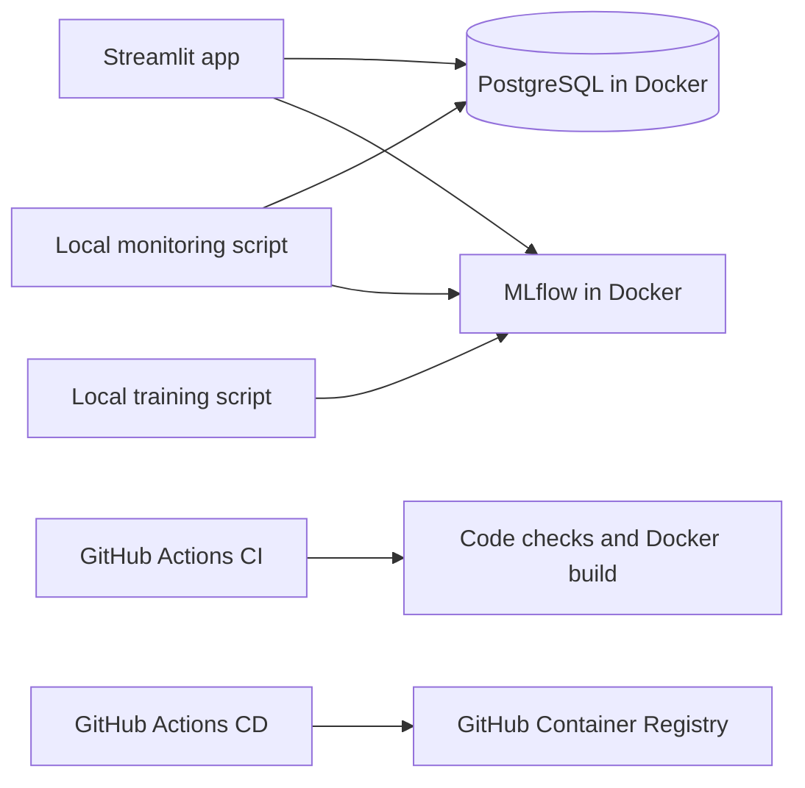
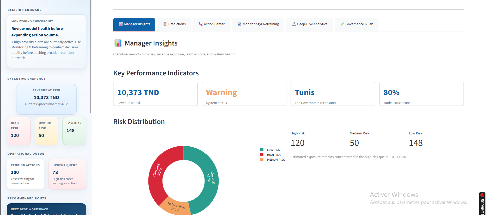

# Customer Churn Prediction - MLOps Experiment

<div align="center">

[](https://customer-churn-prediction-mlops-crubmoactfmxfhqkzkyw92.streamlit.app)

A customer churn prediction project exploring how model training, inference, tracking, monitoring, and CI/CD can fit together. Training and monitoring are run locally; GitHub Actions handles CI and container delivery. PostgreSQL runs as a Docker Compose service.

**Run locally:** `python -m pip install -r requirements.txt`, then `streamlit run streamlit_app.py` from the repository root. For the full local stack, use `docker compose up --build`.

</div>


## Table of contents

- [Preview](#preview)
- [Problem statement](#problem-statement)
- [Technical stack](#technical-stack)
- [About the project](#about-the-project)
- [Architecture](#architecture)
- [Local setup](#local-setup)
- [App sections](#app-sections)
- [Local training and monitoring](#local-training-and-monitoring)
- [GitHub Actions: CI/CD](#github-actions-cicd)
- [Project scope and next steps](#project-scope-and-next-steps)
## Preview

<p align="center">
  
</p>

## Problem statement

Customer churn can reduce recurring revenue, and a churn score alone does not explain which customers may need attention or how teams can organize follow-up. This project explores a practical workflow for identifying at-risk customers, reviewing prediction results, and recording retention actions. It also provides a place to experiment with model tracking and monitoring. The project is an MLOps learning experiment; training and monitoring currently run locally.

## Technical stack

| Component | Role in this project |
|---|---|
| [](https://streamlit.io/) | User interface for customer predictions, insights, retention actions, and model review. |
| [](https://www.postgresql.org/) | Stores prediction and governance history; runs as a service in Docker Compose. |
| [](https://mlflow.org/) | Tracks local training and monitoring runs. |
| [](https://www.docker.com/) | Runs the app, PostgreSQL, and MLflow together for local development. |
| [](https://github.com/features/actions) | Runs CI checks and builds/publishes the container image through CD. |
## About the project

This project applies customer churn prediction to a small operational workflow. The Streamlit app supports individual predictions, customer risk review, retention actions, and model evaluation. PostgreSQL stores prediction and governance records in the local Docker setup, and MLflow records experiment runs.

This is an MLOps learning experiment rather than a fully automated production platform. Model training and monitoring are run locally with the project scripts. GitHub Actions provides automated code checks and container image publishing. Training and monitoring workflows are also defined, but using them remotely requires externally reachable PostgreSQL and MLflow services and appropriate GitHub secrets.

## Architecture



## Local setup

### Docker Compose

Start the app, PostgreSQL, and MLflow locally:

```bash
docker compose up --build
```

Open the app at `http://localhost:8501` and MLflow at `http://localhost:5000`.

### Python

Install the dependencies and start Streamlit:

```bash
python -m pip install -r requirements.txt
streamlit run streamlit_app.py
```

Optional integration settings are documented in `.streamlit/secrets.toml.example`.

## App sections

The app is organized around a practical review loop: understand the portfolio, score a customer, choose a response, and review the model and outcomes. Each view serves a different decision, while saved prediction history connects the workflow across tabs.

<p align="center">
  
  <br>
  <sub>The dashboard combines a decision-focused sidebar with portfolio indicators and risk distribution.</sub>
</p>

### 1. Manager Insights - understand the portfolio

A management overview of saved predictions and current churn exposure. KPI cards summarize revenue at risk, system status, the area with the highest exposure, and a model trust score. Risk distribution and operational queue summaries help show where customer follow-up is concentrated.

**Useful for:** starting a review, spotting a concentration of risk, and deciding which part of the workflow needs attention.

### 2. Predictions - assess one customer

Enter a customer's profile to calculate churn probability, predicted label, and risk tier. The result includes a plain-language summary of likely churn factors, plus expandable technical driver details. If PostgreSQL is configured, the prediction is saved so it can be reviewed in other sections.

**Useful for:** assessing a specific case and creating a traceable prediction record.

### 3. Action Center - turn risk into follow-up

Work through saved predictions in a decision queue. The view summarizes pending actions, completed actions, known outcomes, and revenue at risk. For a selected customer, it displays relevant context and ranked action recommendations; a manager can record a chosen action and track its status.

**Useful for:** prioritizing outreach and keeping an action history tied to the prediction that prompted it.

### 4. Monitoring & Retraining - review model health

Review saved prediction evidence, model health indicators, drift-style alerts, and the current retraining recommendation. The local monitoring cycle can refresh alerts and, when configured, start local retraining after a threshold is reached. Ground-truth feedback can also be recorded later to compare predictions with known customer outcomes.

**Useful for:** checking whether model behavior or risk patterns warrant investigation or retraining.

### 5. Deep-Dive Analytics - explore customer segments

Explore saved prediction data through focused views for demographics, services, billing and contracts, tenure and usage, geography, and feature correlations. Summary metrics provide context for the charts. The analysis depends on the prediction history available in the database.

**Useful for:** examining how churn risk and customer characteristics vary across segments.

### 6. Governance & Lab - compare a candidate model

Adjust logistic-regression settings, train or evaluate a candidate, and compare its metrics with the current baseline. A governance verdict records whether the candidate should be accepted or rejected, along with a rationale and run details when PostgreSQL is configured.

**Useful for:** making model changes reviewable before choosing to use a candidate.

> **Suggested path:** start with **Manager Insights**, investigate individual cases in **Predictions**, record follow-up in **Action Center**, then review model health in **Monitoring & Retraining**. Use **Deep-Dive Analytics** and **Governance & Lab** for segment analysis and model experimentation.
## Local training and monitoring

Training and monitoring can be started from the repository root:

```bash
python Scripts/run_training.py --reason manual_validation
python Scripts/run_monitoring.py
```

Monitoring accepts options such as `--days 14`, `--threshold 2`, and `--skip-mlflow-logging`. Training saves a local model bundle and can log experiments to MLflow. These scripts are intended to be run locally in the current setup.

<p align="center">
  
  <br>
  <sub>Example model training run recorded in MLflow.</sub>
</p>

<p align="center">
  
  <br>
  <sub>Example monitoring results recorded in MLflow.</sub>
</p>

## GitHub Actions: CI/CD

GitHub Actions is used for repository checks and container delivery:

| Workflow | Trigger | What it does |
|---|---|---|
| CI | Pushes and pull requests | Runs lint checks, compiles Python files, runs the unit suite with coverage, and builds the Docker image. |
| CD | Push to `main`/`master`, version tags, or manual dispatch | Builds and publishes the image to GitHub Container Registry. If `DEPLOY_WEBHOOK_URL` is configured, it also sends a deployment request. |

The repository also contains optional scheduled/manual Training and Monitoring workflows. Those are not the local demo path: they need remote PostgreSQL and MLflow endpoints configured as GitHub secrets.

[](https://github.com/manelnh/customer-churn-prediction-MLOps/actions/workflows/ci.yml) [](https://github.com/manelnh/customer-churn-prediction-MLOps/actions/workflows/cd.yml)

### Workflow screenshots

<p align="center">
  
  <br>
  <sub>Continuous integration workflow in GitHub Actions.</sub>
</p>

<p align="center">
  
  <br>
  <sub>Continuous delivery workflow in GitHub Actions.</sub>
</p>

## Project scope and next steps

This repository demonstrates selected MLOps practices in a local development setup: a prediction interface, experiment tracking, monitoring scripts, a Dockerized database, and GitHub CI/CD workflows. It is not a fully automated production deployment. Training and monitoring are run locally; the optional remote workflows need hosted PostgreSQL and MLflow services.

Possible next steps include connecting the remote workflows to hosted services and validating a deployed container through the CD deployment hook.